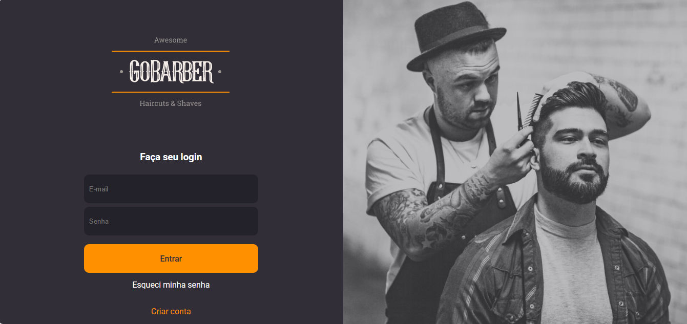

<h1 align="center"> Sistema de gerenciamento de barbearia </h1>

Estudando tecnologias WEB Fullstack com backend nodejs  

  <a href="#-tecnologias">Tecnologias</a>&nbsp;&nbsp;&nbsp;|&nbsp;&nbsp;&nbsp;
  <a href="#-projeto">Projeto</a>&nbsp;&nbsp;&nbsp;|&nbsp;&nbsp;&nbsp;
  <a href="#-layout">Layout</a>&nbsp;&nbsp;&nbsp;|&nbsp;&nbsp;&nbsp;
  <a href="#memo-licença">Licença</a>

  

 

  

 

## 🚀 Tecnologias

Esse projeto foi desenvolvido com as seguintes tecnologias:

- HTML e CSS
- JavaScript
- Git e Github
- Nodejs

## 💻 Projeto

O GoBarber é um sistema de gerenciamento para barbearia a qual o cliente se cadastra e escolhe data e hora para corta o cabelo e fazer a barba.

- [Acesse o projeto finalizado, online](https://#)

- [Assistir aulas](https://#)

## 🔖 Layout

Você pode visualizar o layout do projeto através [DESSE LINK](<https://www.figma.com/file/G3gcrG42KBP2nuQITp6C3z/GoBarber-(Copy)?type=design&node-id=34%3A1180&mode=design&t=kOZjkU7kQfBaA9mg-1>). É necessário ter conta no [Figma](https://figma.com) para acessá-lo.

<!-- ## :memo: Licença -->
